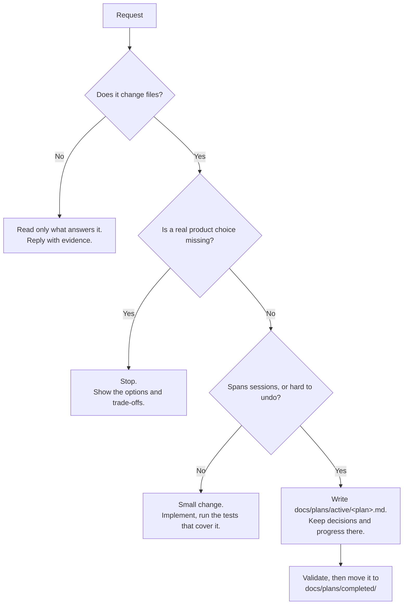
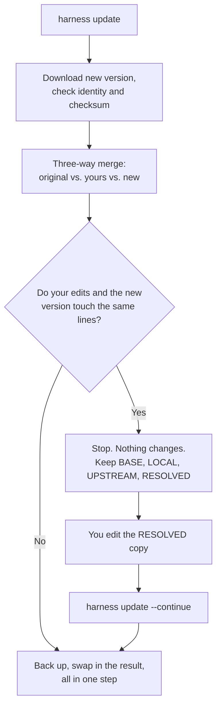

# repository-harness

Make a code repository easy for an AI coding agent to work in.

Harness adds a small set of documents to your repository plus a `harness`
command that installs and updates them safely. The repository stays the source
of truth: docs, code, tests, and CI decide what is true — not chat history.

Harness is not a task tracker, an agent runner, or part of your app.

A fork of
[`hoangnb24/repository-harness`](https://github.com/hoangnb24/repository-harness)
with two changes: it sets up Claude Code as well as Codex-family agents, and it
**runs on Apple Silicon macOS 13 or newer only**. Intel Macs, Linux, and
Windows are not built, tested, or published.

## The Problem

Agents usually fail for boring reasons:

- the important context was only ever said in chat;
- nothing in the repo says which document to trust;
- a one-line fix gets wrapped in heavy process;
- a long task loses track of earlier decisions;
- "done" is claimed with no test or output behind it; and
- the agent invents a product rule the request never specified.

## How Work Gets Sized



A typo needs no plan. A migration across several days does. "Add rate limiting"
with no limit, no key to count by, and no error response is a stop, not a guess.

Start at [`AGENTS.md`](AGENTS.md), then [`docs/WORKFLOW.md`](docs/WORKFLOW.md).

## What Gets Installed

- `AGENTS.md`, a short entry point, and a `CLAUDE.md` shim that imports it.
- A map of the docs and how work flows.
- Folders for product notes, decisions, and plans.
- Templates for plans, decisions, and app runbooks.
- Skill entries under `.agents/skills/` and `.claude/skills/`.

It does not install app architecture, product rules, build commands,
credentials, a database, or anything that runs in the background.

Exact file list:
[`scripts/harness-install-files.txt`](scripts/harness-install-files.txt).

## Install

Run this from the repository you want to set up:

```bash
curl -fsSL "https://raw.githubusercontent.com/mantrandev/repository-harness/main/scripts/install-harness.sh?$(date +%s)" |
  bash -s -- --yes
```

| Flag | What it does |
| --- | --- |
| `--merge` | Keep existing files, add only what is missing |
| `--override` | Replace files; use only when you mean it |
| `--dry-run` | Show what would change, change nothing |
| `--no-claude` | Skip the `CLAUDE.md` shim |
| `--with-engineering-wisdom` | Also install the optional advice skill |

The script downloads a pinned `harness` binary, checks its checksum and
version, then hands the install to that binary.

## Agent Entrypoints

Harness writes into one repository. It never touches global or user-level
agent settings.

Codex-family agents read `AGENTS.md` on their own. Claude Code does not, so the
install also writes a `CLAUDE.md` that `@`-imports `AGENTS.md` inside a marked
block:

```bash
scripts/install-harness.sh --yes              # AGENTS.md and CLAUDE.md
scripts/install-harness.sh --no-claude --yes  # AGENTS.md only
```

If you already have a `CLAUDE.md`, your text is kept: the block is appended
after a backup, an out-of-date block is refreshed in place, a current one is
left alone, and a broken marker pair stops the install instead of guessing.

Each skill is written once under `.agents/skills/<name>/SKILL.md`. A matching
`.claude/skills/<name>/SKILL.md` points at it, so both agents read the same
instructions. Those pointer files are managed like any other core file and are
harmless to agents that ignore them, so `--no-claude` leaves them in place.

See
[`decision 0029`](docs/decisions/0029-multi-agent-entrypoints-and-claude-default.md).

## Keep It Updated

```bash
scripts/bin/harness status
scripts/bin/harness doctor
scripts/bin/harness update --dry-run
scripts/bin/harness update
```



Updates come from this fork's releases, not from upstream.

`harness update --abort` throws away the staged resolution and nothing else.

## Optional Skills

Nothing here runs during install. All of them work from both Codex-family
agents and Claude Code.

| Ask for | What it does |
| --- | --- |
| `$encode-invariant` | Turn an agreed rule into a check the repo actually runs |
| `$onboard-repository` | Read an existing repo first, propose changes second |
| `$improve-harness` | Change Harness itself, with before/after evidence |

Engineering advice ships separately:

```bash
scripts/install-harness.sh --with-engineering-wisdom --yes /path/to/project
```

## What We Prove

Three things are covered by tests:

1. **A fresh install** puts down exactly the declared files, and nothing else.
2. **Navigation works**: an agent can find what is authoritative, and stops at
   a real decision instead of guessing.
3. **Updates are safe**: identity and checksum are verified, your edits
   survive, conflicts are staged, and an interrupted update recovers.

Running someone's app end to end is their job, not ours. Installing Harness
does not supply runtimes, fixtures, credentials, logs, or UI automation.

## Protocol V1 End Of Life

The old SQLite `harness-cli` and machine protocol v1 ended support on
2026-08-10. The last compatibility release is `harness-cli-v0.1.22`. You can
pin it, but this repository no longer builds, installs, tests, or publishes it.

Harness never deletes leftover binaries, databases, schemas, or state from your
repository on its own.

See
[`decision 0027`](docs/decisions/0027-end-protocol-v1-and-focus-repository-protocol.md).

## Development

```bash
scripts/validate-premerge.sh
```

This runs Rust formatting, tests, and Clippy, the installer and workflow
checks, release guards, doc checks, shell syntax, and `git diff --check`.
